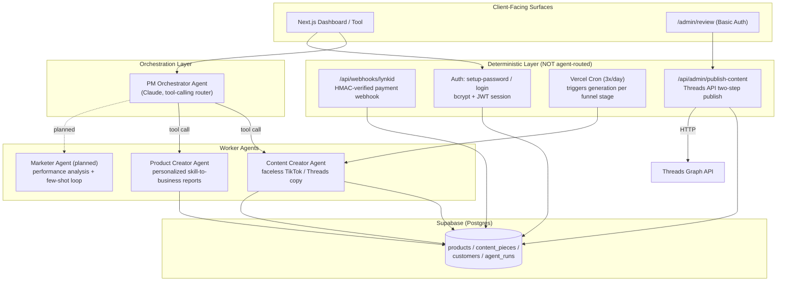
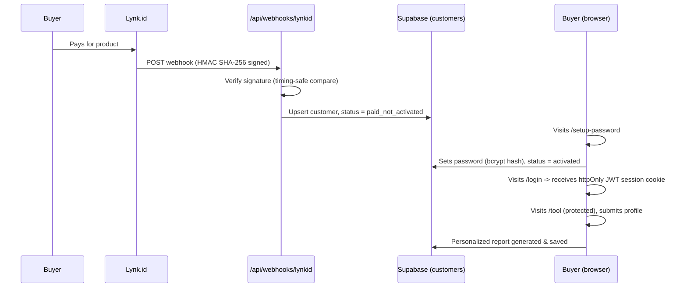
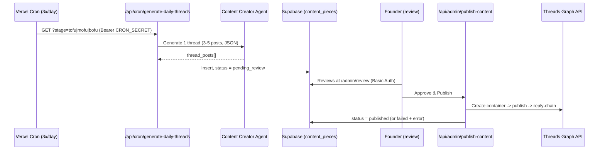

# bapak2shift — Multi-Agent AI System for Digital Product & Content Automation

> A production-oriented multi-agent AI system built as both (1) a real digital product business and (2) a technical portfolio piece demonstrating agentic architecture, tool-use orchestration, and deterministic-vs-agentic system design.

---

## 1. Overview

**bapak2shift** is a digital product and content brand for working fathers in Indonesia who want to build side income and learn new skills around a full-time office job — "shift kedua" (the second shift), the hours after work and after the kids are asleep.

The product itself is an **AI-powered interactive tool**: instead of a static PDF worksheet, buyers fill in their own professional profile (job role, skills, daily constraints, family context) and receive a personalized "Peta Skill ke Ide Bisnis" (Skill-to-Business-Idea Map) report generated specifically for them.

This repository is deliberately built as a **multi-agent system**, not a single-prompt wrapper, so it can double as a hands-on demonstration of agentic AI engineering: supervisor/worker orchestration, tool-calling, deterministic guardrails, auth, and third-party API integration (payments, social publishing).

**Why this matters as a portfolio piece:** most "AI agent" side projects stop at a chatbot demo. This one has real constraints that force real engineering decisions — a payment flow, an auth system, a public-facing product, and a live content pipeline that publishes to a real social platform on a schedule. Those constraints are where the interesting architectural decisions live (see [Section 4](#4-key-architectural-decisions)).

---

## 2. System Architecture

### 2.1 Agent team (supervisor / worker pattern)



**PM Orchestrator Agent** is the router: it receives a goal, decides which worker agent to call via Claude's tool-calling, and returns the result. It does not do the content/product generation itself — that's delegated.

**Content Creator Agent** writes faceless short-form copy (TikTok video/carousel scripts, Threads threads) across the TOFU / MOFU / BOFU funnel stages, in the voice of the `bapak2shift` brand.

**Product Creator Agent** generates the core paid product: a personalized skill-to-business-idea report from a buyer's submitted profile (not a static template).

**Marketer Agent** (planned) will analyze content performance and feed top-performing examples back into the Content Creator Agent's prompt as few-shot references — a self-improving loop implemented through prompt engineering, since Anthropic does not offer public fine-tuning for the Claude API.

### 2.2 Monetization & access flow



No payment gateway is built into this system — Lynk.id handles payment entirely externally. This is an intentional "email allowlist" pattern rather than a full payment API integration, appropriate for early-stage volume.

### 2.3 Content automation flow



Content generation is agent-driven (creative task, benefits from LLM judgment). Publishing is **deliberately not agent-routed** — once the copy exists, publishing is a deterministic sequence of API calls with no decision-making required, so it runs as plain code rather than through the orchestrator. See [Section 4](#4-key-architectural-decisions).

---

## 3. Tech Stack

| Layer | Choice |
|---|---|
| Framework | Next.js 14 (App Router) + TypeScript |
| AI | Anthropic Claude API (`claude-sonnet-5`), native tool-calling |
| Database | Supabase (Postgres), Row Level Security enabled |
| Auth | Custom — bcrypt password hashing, JWT session in httpOnly cookie |
| Payments | Lynk.id (external, webhook-based, HMAC SHA-256 verified) |
| Social publishing | Threads Graph API (two-step container → publish, reply-chained threads) |
| Scheduling | Vercel Cron Jobs (3 daily triggers, one per funnel stage) |
| Deployment | Vercel |
| Dev workflow | Claude Code, VS Code, Git |

---

## 4. Key Architectural Decisions

A few decisions worth calling out explicitly, since they came up as real trade-offs during development rather than being decided upfront:

- **Deterministic operations stay outside agent routing.** The Lynk.id webhook handler and the Threads publish step are both plain API routes, not agent tool calls — even though it would be technically possible to route them through the PM orchestrator. Once content exists, "post it" is a fixed sequence of API calls with no decision to make; routing that through an LLM would add cost, latency, and an unnecessary attack surface (an LLM deciding what to insert into a database from external webhook data is a real risk) for zero benefit. Agents are used where judgment is actually required — content generation, personalization — not for CRUD.
- **Signature verification uses timing-safe comparison.** The Lynk.id webhook and any signed-payload verification use `crypto.timingSafeEqual` rather than `===`, to avoid leaking information through response-time differences (timing attacks).
- **Human-in-the-loop for publishing, not full autonomy.** The content automation pipeline generates drafts on a schedule but requires explicit approval before anything goes live on Threads — appropriate given the content touches personal, emotionally sensitive subject matter (fathers' financial anxieties) where an unreviewed bad generation carries real brand risk.
- **No fine-tuning — few-shot examples instead.** Anthropic does not offer public fine-tuning for the Claude API. The planned Marketer Agent will instead maintain a table of top-performing content examples and inject them into the Content Creator Agent's prompt as few-shot references, creating a self-improving loop through prompt engineering rather than model retraining.
- **Separate `supabaseAdmin` client with the service role key** (never `NEXT_PUBLIC_`-prefixed) for all server-side writes, keeping Row Level Security intact for any future client-side access.
- **`getAuthenticatedCustomer()` returns `null` rather than throwing** on missing/invalid session, so every protected route can use a plain `if (!customer)` guard instead of try/catch scattered across the codebase.

---

## 5. Local Development

```bash
git clone <this-repo>
cd ai-agent-team
npm install
```

Create `.env.local` with the following (see individual setup steps in the build log for where each value comes from):

```
ANTHROPIC_API_KEY=
NEXT_PUBLIC_SUPABASE_URL=
NEXT_PUBLIC_SUPABASE_ANON_KEY=
SUPABASE_SERVICE_ROLE_KEY=
JWT_SECRET=
LYNKID_WEBHOOK_SECRET=
THREADS_ACCESS_TOKEN=
THREADS_USER_ID=
CRON_SECRET=
ADMIN_USER=
ADMIN_PASSWORD=
```

```bash
npm run dev
```

---

## 6. Author

Built by [Antonius Budi Susilo](https://github.com/budibucus) — an IT Project Manager building this as a dual-purpose project: a real digital product business, and a hands-on demonstration of agentic AI system design for future AI engineering / automation roles.
